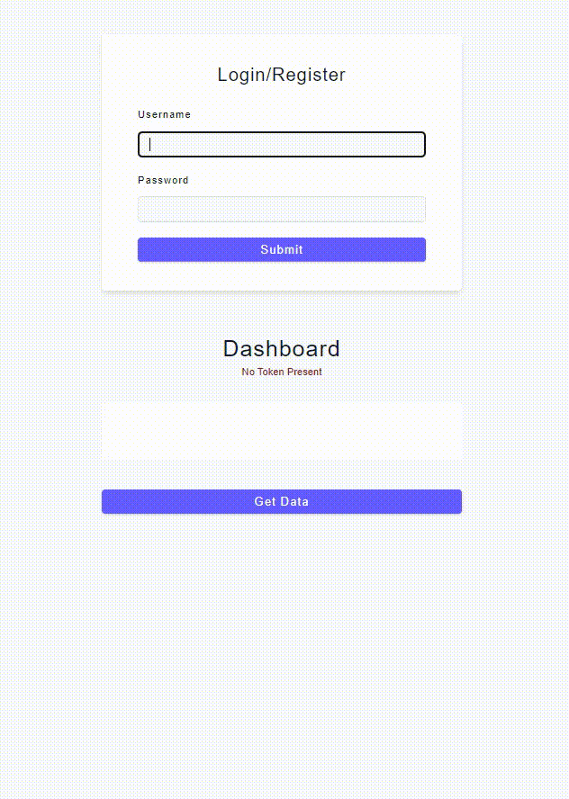

# JWT-Basic-Registration-Login
A login page where you can register yourself, then access the dashboard message that generates a random number. No access is granted 
without prior registration. This is a basic implementation of `authentication` and `authorization` using `JSON Web Token`

## In the project directory, you can run: 
### `npm install` and then `npm start`

### 

## Created using:
### `Node.js`
### `Express.js`
### `MongoDB/Mongoose`
### `express-async-errors` - to eliminate use of multiple try catch blocks repeatedly
### `http-status-code` - to provide STATUS CODES for errors.

## Testing using
### `Postman`

## This project is for learning purposes.
### Source from freeCodeCamp:
https://youtu.be/qwfE7fSVaZM
